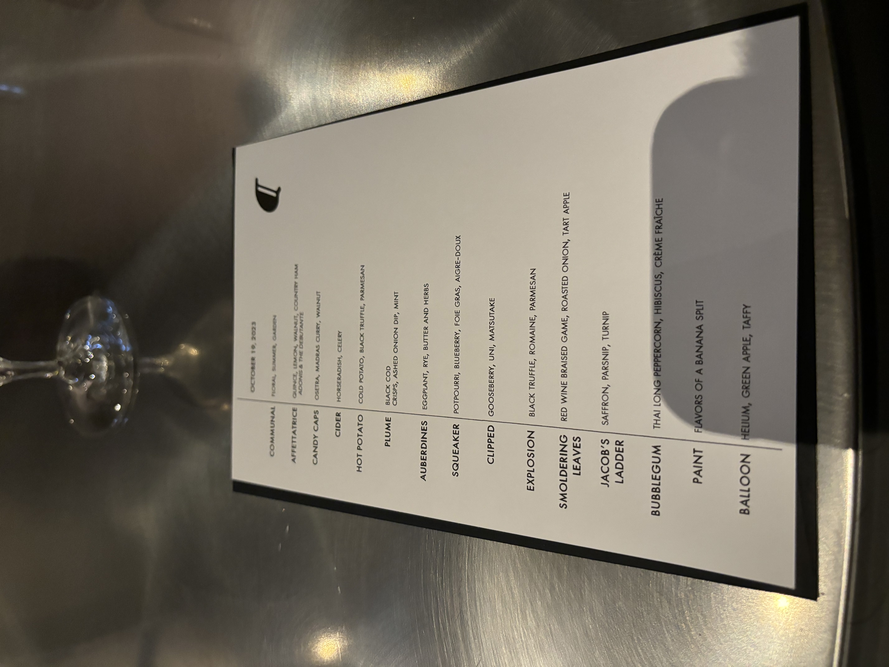

<!--more-->

|------------|-------------------------------------------------------------------------|
| **Rating** |   *Overall* ***3.4/5***  (Taste 2/5, Presentation 5/5, Ambience 3.5/5)|
| **Cost**   | $435pp                                                                  |
| **Location** | Chicago, IL, USA                                                      |
| **Head Chef** | Grant Achatz                                                         |
| **TL;DR**  | engaging experience with whimsical fare that tests boundaries of gastronomy |

{% include image.html
   url="../assets/image/alinea/restaurant.jpg"
   width="50%"
   center="true"
%}

Following a day of work, I had the opportunity to dine at Alinea. The restaurant is tucked in a relatively quiet area of Old Town with an easily overlooked facade. We were seated at The Gallery where we were brought in to a dimly lit room with a long, communal table filled with glass flora.

   
   
      
      

The amuse-bouche assortment was so-so, having a interesting textural contrasts between the crispy tart (itself having popping roe and and the snappy green beans), the softer cake, and the condensed sunflower ball ***(2/5)***. Next, the vegetable wand was interesting to look at, but frankly, I didn't even get to taste this before it was whisked away ***(1.5/5)***. We were also handed a complimentary glass of champagne ***(2/5)***.

Lastly, the garden gazpacho was served to us within a fragile, glass-blown flower with the pistil serving as a spoon. The flowers were extremely interesting to eat out of, enhacing the idea of delicacy, but the soup was not good. The consistency was akin to shaved ice and tasted much too sharp and sour  ***(1/5)***. 

Of note, throughout our meal, there was a large stone fixture of a fountain containing what had been presumed to be water. After some story-telling, the waiter asked for two volunteers to assist in pouring two jugs of liquid into said fountain; I obliged, helping with the creation of a later drink.

   
   
   

Following this, we were quickly ushered into the kitchen where we witnessed the construction of the cobbler dish. Chefs sliced cured ham, cut precise pieces of peach, and assembled a solid yet forgettable dish. It again featured contrasting textures as well as combined nuttiness, umami, and syrupy-sweetness from the walnut, ham, and peach, respectively ***(3/5)***. To compliment the dish, we were served a sherry from the fountain: our creation from just a few minutes ago ***(2/5)***.

   
   

Upon return to the gallery, the dining room is completely transformed, where it’s well lit and tables are separated. Our first dish is a palm of caviar and walnut, where custom-made glass blown "shells" serve as our plate. Briny and nutty, this was an innovative take to combine all of our senses by involving the tactility of our palms ***(3/5)***. 

Next was a "shot" of apple cider and celery juice in a horseradish shell. Personally, I did not enjoy the sour flavors, but it was at least interesting breaking up the horseradish "wax" shell in my mouth to reveal a cool liquid inside ***(1.5/5)***. 

   
   
   

The next dish was the classic "Hot Potato Cold Potato," and upon removing the spear, you get a sharp contrast of textures and temperatures in a buttery, comforting, and yet fleeting slurp. The combination of the vichyssoise, Parmesan, truffle and potato forms was very imaginative and it was made clear why this is a staple ***(4.5/5)***.

Next we had the black cod with potato chips and onion and mint dip. It was smoky and soft, and the onion dip was addictive ***(3.5/5)***.

   
   
   

   
   

 The subsequent "sardine" eggplants were quite tough and while an interesting concept, it fell short on the flavor department for me. Savory and atop a buttery crisp, it felt difficult to eat ***(1.5/5)***.

   
   

The biscuit was warm, buttery, and flaky. The two jams provided good contrast with sweetness, tartness, and richness **(3.5/5)**.

   
   

The squab was perfectly cooked, hitting on its tenderness and flavor. It had the right amount of gaminess and the rehydrating jous was rich and umami, providing textural contrast when the crunchy vegetables were applied ***(4/5)***.

The next set of courses were gooseberry themed, and for the uni they again brought out a tactile bowl for an interesting sensation. All three played on the use of sweetness and savoriness, with my only complaint being my desire for a napkin after the chicken wing. Otherwise, the individual ingredients really stood out, with the individual rice granules tasted and the mushrooms having natural fungal flavor and bite ***(4/5)***. 

   
   

The following was another Alinea classic called the "Truffle Explosion," where we were advised to eat with our mouths shut to get all of the flavor. This truly lived up to the hype; inside was a decadent amount of truffle juice, with the other ingredients primarily providing texture ***(4.5/5)***. 

This was followed up with a stranger looking dish consisting of a fried meatball attached to a flaming stick. The meatball consisted of numerous different meats, apple, and onion, but for me, the flavors mixed a bit together. The presentation was interesting, if not a little out of place, and the seasoning was done well, but this was not a standout ***(3/5)***.

   
   

Next, we were introduced to dishes that relied heavily on parsnip flavor. First, we were presented with a plate of wagyu short rib and various root vegetable chips and mash. Next, we were introduced to a mysterious large white mound which was later revealed to be jameed, a solidified Middle Eastern yogurt.

   
   

The jameed was shaved over the shortrib, providing a bit of saltiness and tanginess to the cut of meat. The shortrib itself was absolutely delicious; it was cooked excellently and had melt-in-your-mouth texture. The sides to this dish were okay and didn't overwhelm the flavors of the meat ***(4/5)***. 

On the side, the parsnip puree was pungent and had crunchy nibs, but the plate itself was somewhat forgettable. The flavor of the dish, with a funk similar to an onion, lingered in your mouth ***(2/5)***. 

   
   
   

Dessert was an amazing experience. The first tea served in a tube tasted exactly of Hubba Bubba and set the tone for the playfulness of the following dishes. Held together at the ends with just crème fraîche, the dessert was super interesting to taste ***(4/5)***.

"Painted Dessert" was a spectacle to behold as lights dimmed and our table was shrouded with dry ice. As one chef came by, assembling the art using various components and then smashing the liquid nitrogen banana ice cream, one was just holding their breath as the choreography took place and we ate directly off the table. Additionally, every component was tasty, not too sweet, and had quite large portion sizes. The only room for improvement would be to in the depth of the individual flavors ***(4.5/5)***.  

Lastly, we were handed a fully edible balloon of apple toffee with helium to play with. It was sweet, but the main appeal was the high-pitched voices from the helium ***(3.5/5)***.

{:.glightbox}

## BBB



*17-02*, "Painted Dessert," has to be the standout at Alinea for me. I think it really encapsulates the best of what Alinea has to offer: an immensely entertaining dish with novel ways to eat, where the selling point isn't necessarily the intensity or complexity of its flavors, but rather the entire eating experience.