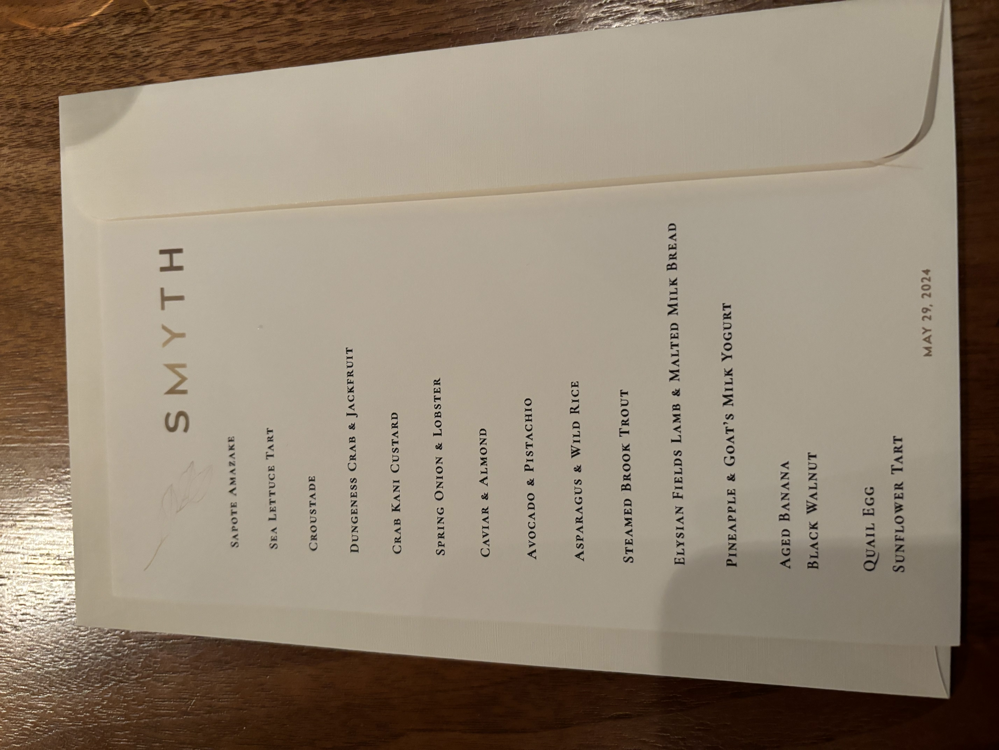

<!--more-->

|------------|-------------------------------------------------------------------------|
| **Rating** |   *Overall* ***3.2/5***  (Taste 3.5/5, Presentation 2/5, Ambience 4.5/5)  |
| **Cost**   | $325pp                                                                  |
| **Location** | Chicago, IL, USA                                                      |
| **Head Chef** | John Shields, Karen Urie Shields                                     |
| **TL;DR**  |  a creative celebration of forest and sea in a casual but attentive environment|

{% include image.html
   url="../assets/image/smyth/restaurant.jpg"
   width="50%"
   center="true"
%}

Nestled in the West Loop, stepping into Smyth, you are invited into an assuming layout with an open kitchen that lacks the stuffiness of many other Michelin starred restaurants. The wait staff are friendly and the ambience invites an air of warmth with its open kitchen. At the time of dining, Smyth had been awarded its third star for the first time.

  
  
  

To start off, as a precursor to the rest of the courses each with a somewhat Japanese flair, we were presented with the slightly alcoholic, fermented amazake with fruity pineapple notes and a large sprig of pineapple leaf. It was fresh, fruity, and provided good sweetness to begin with ***(3.5/5)***. The tart had a bit of an overwhelmingly herbal flavor with the fennel and dill but these flavors overall went well with the kelp and the prawn, which provided a mushier textural contrast ***(3/5)***. The quail egg dish provided a strong burst of flavor as the yolk exploded while the other ingredients were a bit more muted ***(3/5)***. 

  
  

The following two dishes held with more seafood - the Dungeness crab bite was akin to eating fruit with a briny crab aftertaste. The jackfruit largely dictated the texture but there was a good mix of saltiness and sweetness in the bite ***(3.5/5)***. 

The crab custard, almost a chawanmushi, was one of the best courses, fusing a rich crab flavor with passionfruit for intense umami and sweetness in every bite. The consistency was soft and delicate, but very savory. It came with an interesting slanted, wooden spoon to aid in getting all the corners of the square plate ***(4.5/5)***. 

  
  

From here, if the previous dishes were ocean-themed, the next four seemed to be more land- and earth-themed. The following onion dish was largely forgettable. The onions themselves roasted well and tart, but at the end of the day, they were simply just well-prepared onions. The lobster consommé did not provide too much support for flavor ***(2/5)***.

The caviar dash had a very odd presentation - it was caviar stuck to the side and slowly sliding down into the walnut sauce. In my opinion, this seemed a bit messy and unrefined; we were given almonds and rose butter to alternate enjoying the caviar with, and while they both were pleasant, the rose butter had a much stronger, richer flavor, providing decent contrast ***(2/5)***.

  
  

We were presented with an intermittent palate cleanser, which was effective and fresh. It combined the apple, eucalyptus, and avocado to provide an earthy dish with a peanut milk bed, a bit like a vegetable ice cream. The flavors were subtle and inoffensive, with the iciness and creaminess standing out ***(3/5)***. 

The following asparagus dish fell a bit flat. The cream sauce and purée were just fine, if not a bit tart, and the asparagus tips were properly cooked and nicely textured but lacked much beyond their initial flavor. The inedible spruce was also a bit strange ***(1.5/5)***.

  
  
  

I was a big fan of the rainbow trout. The meat's consistency after being cooked was almost gelatinous, in stark contrast to its flaky skin and kombu. Laying atop the congee allowed the rice to soak up much of the sauce and flavor. The soy glaze was sweet and went well with the bed of turnip juice braise ***(4/5)***.

Their next dish was “Lamb in Many Ways,” where the rack was notably delicious and tender while the sausage was unremarkable but savory, meaty, and salty. The fried lamb fat was also crispy ***(3.5/5)***. The milk bread was fresh, fluffy, and warm, covered in a sweet glaze. It accompanied the lamb heart and habañero sauce well, forming a very unique set of ingredients to combine sweetness with spiciness and tang. I was impressed with Smyth’s willingness to try different combinations of ingredients and look to provide contrast in flavors and textures ***(4/5)***.

  
  
  

Onto dessert, the goat cheese texture was just like a perfectly chilled ice cream and the tartness provided by the pineapple with the sweetness of the honey fit together well ***(3.5/5)***. Their banana dish was creative, essentially reconstructing the fruit in novel ways. The custard flavor was strong and we were instructed to bite once into the walnut truffle, finish the "banana," and finally revisit the truffle, maintaining up its sweetness. This "reconstruction" effectively brought out the banana flavor while rotating with the nuttier truffle mixed well. The sweet, chewy kombu was an interesting touch ***(4/5)***. 

  
  
  

We were presented with ganache "quail eggs" within a woven nest, and while the chocolate part was good, I was not a fan of the strong lemon rind flavor, which was almost overpowering ***(2/5)***. The graham cracker shot had quite a neutral ganache but the flower flavor was a bit stronger than I would've liked. I would've preferred they introduce a more leading flavor within the ganache and held out on the number of flowers they put on top ***(1.5/5)***. The sea lettuce caramel tasted of seaweed and evoked flavors similar to that of Japanese snacks ***(3/5)***.

Additionally, throughout our meal, the service was especially excellent as left- or right-handedness, towels, and dish explanations were handled with care. It was evident how attentive our waiters and waitresses were even compared to the 3 Michelin star standard.

{:.glightbox}

## BBB


*05* was my favorite of the dishes at Smyth. The Asian influenced chawanmushi had an exceptional balance of sweetness, savoriness, and saltiness and showed how a creative choice of ingredients can yield new ways to enjoy dishes.