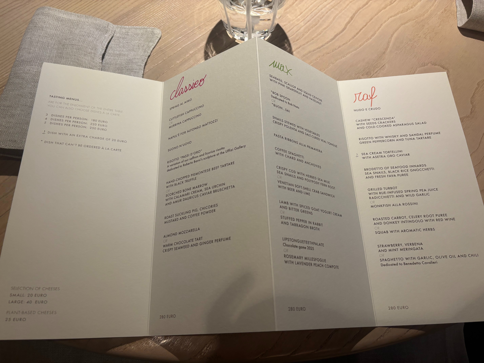

<!--more-->

|------------|-------------------------------------------------------------------------|
| **Rating** |   *Overall* ***3.6/5***    (Taste 4/5, Presentation 4/5, Ambience 2/5)          |
| **Cost**   | €280pp                                                                  |
| **Location** | Rubano, Italy                                                         |
| **Head Chef** | Massimiliano Alajmo                                                 |
| **TL;DR**  |  modernized, authentic Italian fare elevating familiar ingredients with artistic flair|

{% include image.html
   url="../assets/image/le_calandre/restaurant.jpg"
   width="50%"
   center="true"
%}

After an hour long ride on the Regionale train from Venice, followed by another 30 minute cab ride, one arrives at the door of Le Calandre, guarded by its large red wolf statue. The interior is dimly lit, and at each table is a divot with a ball of yarn. To get to our table, we walk past lampshades of dried stockfish skins and a large cart of cheese.

   
   

At our seats are already placed napkins with assorted breadsticks tucked in-between. Some tasted like cheez-its, others like nutty, grain crackers, and the remaining like thick breadsticks ***(2.5/5)***.

Our amuse bouche was par. The pea tart had quite an herbal, rosemary-like flavor to it. The crispy deep-fried olive was interesting texturally, although I'm not a huge fan of the olive flavor. The parmigion reggiano bite was warm and savory, with a nice chew to it. The two cheese puffs had relatively similar flavors and textures (with their mild notes of their respective spice), and were melted as they sat in your mouth ***(2.5/5)***. 

   
   

The bread dish was hurriedly brought out in the middle of us eating the amuse bouche, which I found a bit odd. Itself, it was nothing special, not piping hot. They replaced the ball in the center with the bread wrapped in a towel as a parcel. The olive oil had a sharp herb which wasn't exceptionally tasty ***(2.5/5)***.

   
   

In what was seemingly a worrying trend, our first dish came out almost immediately. The salad brought together different presentations of vegetables, most of which were chilled. There was a large crunchy brick, the fava bean cream had decent savoriness, and the soaked crouton had an almost arugula, Asian flavor. One interesting component was that the purple ball I had mistakenly presumed to be a roasted shallot; instead, it was a mozzarella ball with a red beet juice inside. Unfortunately, this salad did not taste good; it was a bit too sharp and the zucchinini noodles, among others, tasted too raw. It felt as if it was trying to do to much ***(1/5)***. 

The next dish was called "Murrina Cappuccino", and it was stunning. Inspired by the glass from the Murano island off of Venice, the immediate visual appeal of the dish was apparent. Tasting it, the potato cream and olive oil combination was rich and buttery, while the cuttlefish chunks were perfectly cooked, with just the right amount of bite. The flavor was akin to a much elevated clam chowder. The only slight drawback was that it was a tad salty ***(4.5/5)***.

   
   
   

For our next dish, we are presented with adorned with text written in seaweed, "Napul'è for Alfonso Mattozzi" which is revealed to be inspired by the chef's favorite Pizza place in Naples. The dish itself is a reconstructed pizza with puff pastry and ricotta and mozarella inside. The dish indeeds hits with warmth and familiar flavors, albeit elevated. The mozarella inside is chewy and the execution with the basil is done well, although I wish it was a tad warmer ***(3.5/5)***.

Following that dish, we had an egg shell taglietelle alongside a pair of earplugs! We are instructed to close our eyes when chewing to really allow the egg plant texture and sensation to be focused upon. This was a really interesting experience, and the egg shell crunch coupled with the al dente noodles really stood out. The cream was rich and the cheese and herbs are done well. The broth was soothing, herbal, and had a hint of peppercorn that numbed the throat before the next dish ***(4.5/5)***.

   
   
   

To prepare us for the next course, we are presented with an empty glass infused with licorice and saffron which we are to smell. The dish is Le Calandre's famous risotto, inspired by a Roberto Barni sculpture in Uffizi. This was a very complex dish, with each bite having a multitude of flavors. To start, the risotto was cooked a perfect al dente. The veal broth provided a savory base, and bites had spiciness from the licorice, sour from the citrus, and umami from the saffron. Despite mixed reviews at the table, I adored the execution ***(4.5/5)***. Interestingly, it looked like the tables nearest us (who seemed friendly with the chef) received the remaining pots of risotto!

   
   

We had two options for the next main dish. I opted for the beef tartare with black truffle which interestingly came with no utensils, only a hand towel for afterwards. The meat felt very fresh and the balsamic vinegar and lettuce also added crispness to the dish. The aioli itself was light, although this wasn't a stand out ***(3.5/5)***. 

The other option pictured was a scorched bone marrow with calamari cream and a caviar bruschetta. The marrow was described as delicious and fatty, but not greasy, while the cracker itself was elegant. The flavors were heavily inspired by the burning herb.

   
   

 
The final savory dish was a roasted suckling pig with mustard greens and a coffee-powdered cream. The dish was alright, a bit gamey but the crisp of the skin provided strong textural contrast with the more easily broken down meat and the chewier mustard greens. The coffee powder was interesting, but overpowered mostly by the sticky sauce. It was decadent, creamy, but a bit too "porky" ***(3/5)***. 

We then replaced the middle fixture with a ball with fruits on sticks. These were simple but absolutely delicious. The strawberries were coated with pop rocks, which was especially refreshing. The apple had become almost translucent after it seemed to be soaked in sugar water and was aptlysweet. The pineapple was also tart and sweet, without being overly sour ***(4/5)***.

   
   
   

Finally, we had the choice of dessert. I opted for the "Almond Mozzarella," a candied shell of sugar that encased a foamy, sweet honey, olive oil, and caper mix. Taking a smell, it was exactly akin to a ball of mozzarella, and it came with a tag describing the mozzarella's "origin." Unfortunately, this was hit or miss for me. The exterior stuck to my teeth and was a bit chalky, while the taste was too sweet or had too strong of an olive oil and caper flavor. Still, points are given for the interestingness of the idea ***(2/5)***. 

The other option was a simple warm chocolate tart. This was described as okay, with the ginger being a tad strong. It is worth noting that at this point, we were all incredibly full, and unable to fully enjoy and finish the desserts.

The petit fours were quite nice. The lemon ice cream was the right sweetness and chilled. The matcha was rich and sweet, while the dark chocolate had strong flavors ***(3/5)***. 

{:.glightbox}

## BBB



*08-02*, the "Risotto 'Passi D'Oro'" was the standout dish for me for its complexity while elevating a more authentic Italian dish. For me, it represented Le Calandre's ability to truly elevate the flavor profile of a more simple dish, risotto, while having a clear inspiration in the Uffizi sculpture, all while looking like a true work of art. The clear attention to detail when constructing the flavor profiles, the perfect cooking techniques, and the adherance to Italian cuisine make this a hit for me.